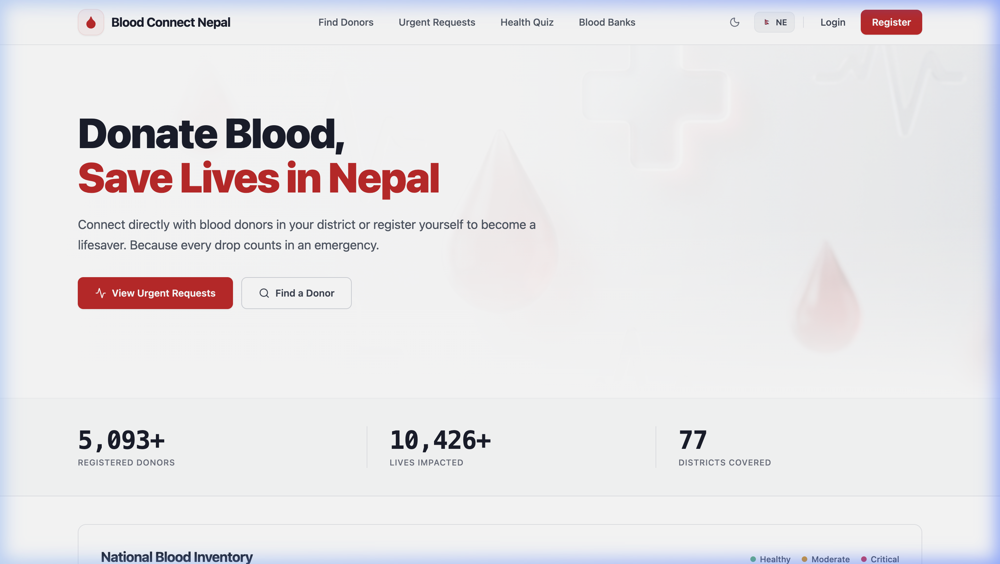
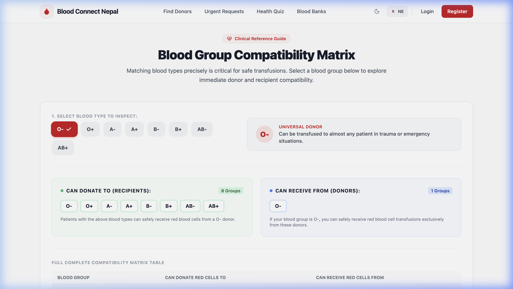
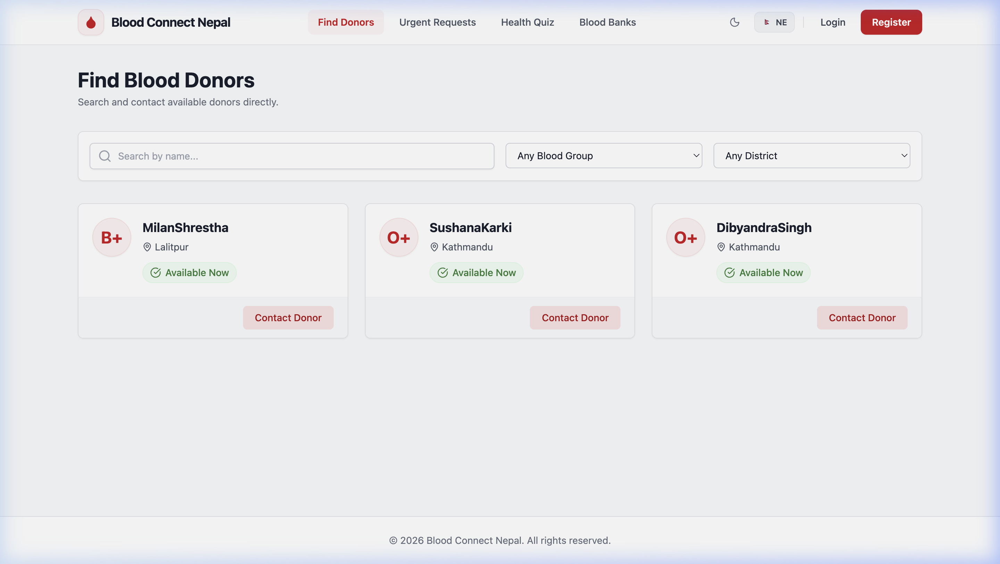
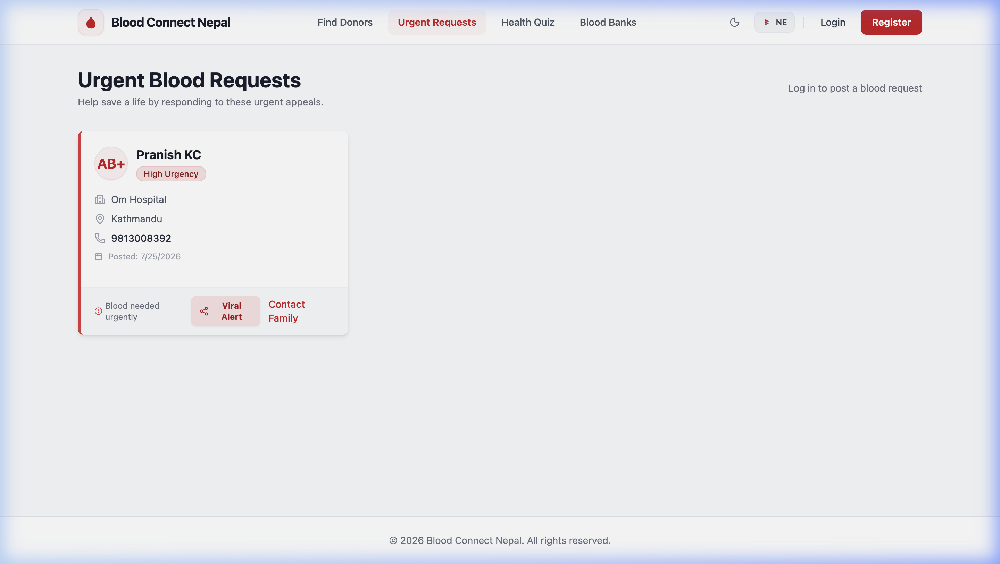

# 🩸 Blood Connect Nepal
### Real-Time Emergency Blood Donation & Healthcare Infrastructure for Nepal 🇳🇵

[](https://reactjs.org/)
[](https://vitejs.dev/)
[](https://www.djangoproject.com/)
[](https://www.django-rest-framework.org/)
[](https://tailwindcss.com/)
[](https://github.com/MilanXrestha/Blood-Connect-Nepal)
[](https://opensource.org/licenses/MIT)

---

## 🌟 Overview & Mission

**Blood Connect Nepal** is a modern, enterprise-grade civic healthcare platform built to eliminate life-threatening delays in emergency blood transfusions across all **77 districts of Nepal**. By connecting blood donors directly with patients and hospital intensive care units, the platform streamlines urgent blood requests, tracks real-time inventory, and provides clinical education—all with zero middleman friction.

Designed with a sleek, minimalist **Silicon Valley glassmorphism UI** (inspired by Apple Health, Linear, and Stripe), Blood Connect Nepal ensures that finding a lifesaving donor in an emergency is as fast, reliable, and accessible as possible.

---

## 📸 Website Showcase & Screenshots

| 🏥 **Sleek Medical Hero & Live Impact Stats** | 🩸 **Interactive Compatibility Matrix & Medical Insights** |
|:---:|:---:|
| [](screenshots/homepage_hero.png) | [](screenshots/homepage_compatibility.png) |
| *High-contrast typography with dual-gradient masked medical illustration, live donor counts, and instant call-to-actions.* | *Interactive selector highlighting exact "Can Donate To" & "Can Receive From" groups alongside bilingual clinical facts.* |

| 🔍 **Verified Donors Directory (77 Districts)** | 🚨 **Live Emergency Appeals Feed** |
|:---:|:---:|
| [](screenshots/donors_directory.png) | [](screenshots/urgent_requests.png) |
| *Tabular Registry View with verified donor badges, district filtering, availability status, and one-tap emergency contact.* | *Real-time urgent blood requests categorized by severity (Critical/High/Normal) with hospital location tags.* |

---

## ✨ Key Platform Features

- 🌐 **Full Bilingual Localization (English & नेपाली)**: Seamlessly toggle between English and Nepali across the entire web app with context-aware medical and healthcare terminology.
- ⚡ **Silicon Valley Glassmorphism UI**: High-end aesthetic featuring frosted glass navigation (`backdrop-blur-md`), dark mode compatibility, responsive widescreen layouts, and clean tabular typography.
- 📊 **Real-Time Blood Stock Analytics**: Live interactive chart visualizing blood unit inventory across all 8 major blood groups (`O-`, `O+`, `A-`, `A+`, `B-`, `B+`, `AB-`, `AB+`).
- 🧭 **77-District Dispatch & Filter Engine**: Quickly filter verified donors by district, availability status (*Available / Currently Unavailable*), and specific blood type with immediate telephone contact integration.
- 🤝 **Interactive Clinical Compatibility Guide**: Dynamic matrix table allowing doctors, donors, and recipients to verify safe transfusion pathways instantly.
- 🚨 **Urgent Appeals & Emergency Feed**: Create, view, and share urgent blood requests with hospital names, patient requirements, and urgency level badges.
- 🔐 **Secure Auth & Donor Verification**: Token/Session-based user authentication, verification badges for repeat donors, and personal donation tracking.

---

## 🛠️ Tech Stack Architecture

### **Frontend**
- **Framework**: React 18 (with Vite 8 Build Tooling)
- **Styling**: Vanilla CSS & Tailwind CSS (Custom Design System & Utilities)
- **Icons & Typography**: Lucide React Icons, Inter & Tabular Mono
- **State & Routing**: React Router DOM, Custom Context API (`AuthContext`, `LanguageContext`)
- **Data Visualization**: Recharts (Blood Stock Charts) & CountUp Animations

### **Backend**
- **Framework**: Python 3.10+, Django 5.x
- **API Engine**: Django REST Framework (DRF)
- **Database**: SQLite (Development) / PostgreSQL (Production Ready)
- **Security**: Django CORS Headers, Session/Token Authentication, Custom Permissions

---

## 🚀 Complete Setup & Installation Guide

Follow these simple steps to get the full-stack development environment running locally on your machine.

### Prerequisites
- **Node.js** (v18+ recommended)
- **Python** (v3.10+ recommended)
- **Git**

### 1. Clone the Repository
```bash
git clone https://github.com/MilanXrestha/Blood-Connect-Nepal.git
cd Blood-Connect-Nepal
```

### 2. Backend Setup (Django REST API)
Open a terminal window and navigate to the `backend` folder:
```bash
cd backend

# Create and activate Python virtual environment
python3 -m venv venv
source venv/bin/activate  # On Windows use: venv\Scripts\activate

# Install required backend dependencies
pip install django djangorestframework django-cors-headers

# Apply database migrations and create schema
python manage.py migrate

# (Optional) Load initial sample donor and blood bank data
python manage.py seed_donors
python manage.py seed_blood_banks

# Start the Django API development server
python manage.py runserver
```
✅ The backend API server will now be live at **`http://127.0.0.1:8000/`**.

### 3. Frontend Setup (React + Vite)
Open a **new** terminal window and navigate to the `frontend` folder:
```bash
cd frontend

# Install Node dependencies
npm install

# Start the high-speed Vite development server
npm run dev
```
✅ The frontend application will now be live at **`http://localhost:5173/`**.

---

## 📁 Repository Structure

```
Blood-Connect-Nepal/
├── backend/                        # Django REST Framework Backend
│   ├── api/                        # API routes, serializers, views, and data models
│   │   ├── management/commands/    # Custom seeders (seed_donors, seed_blood_banks)
│   │   ├── migrations/             # Database schema migrations
│   │   ├── models.py               # User, Donor, BloodRequest, and BloodBank models
│   │   ├── views.py                # REST endpoints and business logic
│   │   └── urls.py                 # API route mapping
│   ├── core/                       # Django project settings and CORS configuration
│   └── manage.py                   # Django CLI utility
│
├── frontend/                       # React 18 + Vite Frontend Application
│   ├── public/                     # Static assets (hero_bg.png, illustrations)
│   ├── src/
│   │   ├── components/             # Reusable UI components
│   │   │   ├── Navbar.jsx          # Glassmorphism bilingual navigation bar
│   │   │   ├── BloodCompatibilityMatrix.jsx # Interactive clinical compatibility guide
│   │   │   ├── BloodStockChart.jsx # Live inventory analytics visualization
│   │   │   └── Leaderboard.jsx     # Top verified donors tabular view
│   │   ├── context/                # AuthContext and LanguageContext (Bilingual i18n)
│   │   ├── pages/                  # Main application pages (Home, Donors, Requests, Register)
│   │   ├── App.jsx                 # Route configuration and layout wrapper
│   │   └── index.css               # Design system tokens and Tailwind styles
│   ├── package.json                # Frontend dependencies and build scripts
│   └── vite.config.js              # Vite bundler configuration
│
├── screenshots/                    # High-resolution web application showcase images
└── README.md                       # Project documentation
```

---

## 🤝 Contributing

We welcome contributions from developers, designers, and healthcare professionals!
1. Fork the Project
2. Create your Feature Branch (`git checkout -b feature/AmazingFeature`)
3. Commit your Changes (`git commit -m 'Add some AmazingFeature'`)
4. Push to the Branch (`git push origin feature/AmazingFeature`)
5. Open a Pull Request

---

## 📄 License

Distributed under the MIT License. See `LICENSE` for more information.

---
<div align="center">
  <p>© 2026 Blood Connect Nepal. All rights reserved.</p>
</div>
